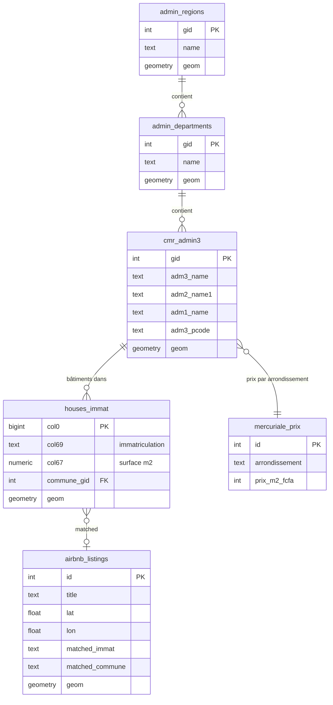

# Dashboard DGI Cameroun — Documentation Technique

## 1. Contexte et Objectif

### Problème
La Direction Générale des Impôts (DGI) du Cameroun n'a **pas de vue consolidée** du potentiel fiscal foncier à l'échelle nationale. Les données existent dans des systèmes séparés : cadastre (immatriculations), imagerie satellite (bâtiments), mercuriale officielle (prix au m²), et plateformes en ligne (Airbnb). Aucun outil ne les croise.

### Solution construite
Un **dashboard cartographique interactif** qui :
- Croise toutes ces sources dans une base unique (PostgreSQL/PostGIS)
- Visualise le potentiel fiscal par niveau administratif (Région → Département → Commune)
- Identifie les bâtiments à usage commercial non-déclaré via Airbnb
- Permet au décideur DGI de naviguer du national au local en quelques clics

---

## 2. Données Sources — D'où viennent-elles et pourquoi

### 2.1. Table `houses_immat` (Données de base — déjà en PostgreSQL)

| Attribut | Détail |
|---|---|
| **Source** | Croisement de données cadastrales (Ministère des Domaines) + empreintes bâtiments satellite (OpenStreetMap) |
| **Volume** | **3 878 886 bâtiments** |
| **Colonnes clés** | `col0` (ID bâtiment), `col67` (surface en m²), `col69` (numéro d'immatriculation), `geom` (polygone du bâtiment) |
| **Particularité** | Chaque ligne = **un bâtiment individuel**. Le numéro d'immatriculation (`col69`) est un identifiant **parcelle** (terrain), pas bâtiment. Donc plusieurs bâtiments partagent le même numéro → c'est normal (une parcelle = une concession avec plusieurs constructions) |

**Pourquoi cette donnée est essentielle** : c'est le socle — elle fournit la **surface imposable** (m²) de chaque construction et sa **localisation GPS** précise.

---

### 2.2. Table `cmr_admin3` (Limites communales — déjà en PostgreSQL)

| Attribut | Détail |
|---|---|
| **Source** | HDX / Institut National de Cartographie du Cameroun |
| **Volume** | **360 communes** |
| **Colonnes clés** | `adm1_name` (région), `adm2_name1` (département), `adm3_name` (commune), `adm3_pcode` (code), `geom` (polygone) |
| **Problème initial** | La colonne `adm3_name` était **vide pour 360/360 lignes** — seule `adm3_name1` contenait des données, et les noms avaient des accents cassés (ex: "B??nou??" au lieu de "Bénoué") |

**Pourquoi cette donnée est essentielle** : elle permet de **rattacher chaque bâtiment à sa commune** pour calculer l'impôt par zone géographique.

---

### 2.3. Fichier `OSMB Cameroon GeoJSON` (Frontières administratives complètes)

| Attribut | Détail |
|---|---|
| **Source** | OpenStreetMap Boundaries — fichier `F:\OSMB-...Cameroon.geojson` (20 Mo) |
| **Volume** | **509 polygones** sur 6 niveaux |
| **Niveaux** | Level 2 (1 pays), Level 4 (10 régions), Level 6 (58 départements), Level 7 (13 sous-divisions), Level 8 (361 communes), Level 10 (66 villages) |

**Pourquoi ce fichier** : `cmr_admin3` ne contient que les communes (dernier niveau). Pour un dashboard qui permet de naviguer **du national au local**, il nous fallait les niveaux supérieurs : **Régions** et **Départements**. Ce fichier les fournit.

#### Transformations effectuées

1. **Extraction Level 4 → Table `admin_regions`** (10 lignes)
   - Chaque polygone = une des 10 régions du Cameroun
   - Stocke : nom, nom anglais, coordonnées du centre administratif, géométrie

2. **Extraction Level 6 → Table `admin_departments`** (58 lignes)
   - Chaque polygone = un département
   - Même structure que les régions

3. **Enrichissement de `cmr_admin3` via Level 8**
   - Les 361 communes du GeoJSON ont été utilisées pour **remplir les noms manquants** dans `cmr_admin3`
   - Méthode : jointure spatiale (si le centroïde d'une commune `cmr_admin3` tombe dans un polygone Level 8, on copie le nom)
   - **Résultat** : 359/360 communes ont maintenant un nom dans `adm3_name`

**Choix justifié** : On a gardé `cmr_admin3` comme référence pour les communes (source officielle INC) plutôt que de la remplacer par les données OSM (contributeurs bénévoles, moins fiable). Le GeoJSON ne fait que **compléter ce qui manquait**.

---

### 2.4. Fichier `mercuriale_spm_foncier.json` (Prix officiels du terrain)

| Attribut | Détail |
|---|---|
| **Source** | Décret N° 2014/3211/PM du 29 septembre 2014 — fichier `F:\mercuriale_spm_foncier.json` (37 Ko) |
| **Volume** | **336 arrondissements** avec prix au m² |
| **Plage de prix** | 200 FCFA/m² (zones rurales) à 10 000 FCFA/m² (Yaoundé, Douala) |
| **Règles incluses** | Multiplicateurs par usage (commercial = 2×, industriel = 0.5×), redevances annuelles par type |

**Pourquoi cette donnée** : c'est la **base légale** pour estimer l'impôt foncier. Sans elle, on ne peut pas transformer une surface en montant fiscal.

#### Transformation effectuée

- Chargement direct dans la table `mercuriale_prix` (336 lignes)
- Chaque ligne = un arrondissement avec son prix résidentiel de base
- Les multiplicateurs par usage sont stockés en colonnes mais **non utilisés dans le calcul actuel** car la table `houses_immat` ne contient pas de données fiables sur l'usage des bâtiments (la colonne `col31` / building_type est quasi-vide)

**Formule d'estimation fiscale utilisée** :

```
Impôt estimé = Surface bâtiment (m²) × Prix mercurial de l'arrondissement (FCFA/m²)
```

> **Note importante** : Cette estimation est **indicative**. L'impôt réel dépend de facteurs non disponibles dans nos données (usage réel, réductions légales, antériorité de l'immatriculation, etc.). L'objectif est de donner un **ordre de grandeur** du potentiel fiscal par zone.

---

### 2.5. Fichier `airbnb_data` (Listings Airbnb au Cameroun)

| Attribut | Détail |
|---|---|
| **Source** | Scraping Airbnb — fichier `F:\airbnb_data` (CSV sans header) |
| **Volume** | **752 listings** avec coordonnées GPS valides au Cameroun |
| **Colonnes** | ID, titre, description, latitude (col 11), longitude (col 12), URL Airbnb |
| **Distribution** | 623 dans la région Centre (surtout Yaoundé), 129 dans le Littoral (surtout Douala) |

**Pourquoi cette donnée** : Un bâtiment listé sur Airbnb est utilisé à des fins **commerciales** (location courte durée). Si ce bâtiment est enregistré comme résidentiel au cadastre, il y a un **manque à gagner fiscal** potentiel.

#### Transformations effectuées

1. **Parsing du CSV** : Le fichier est sans header, avec un JSON imbriqué dans une colonne. On extrait ID, titre, description, lat, lon, URL.

2. **Filtrage géographique** : Seuls les listings avec des coordonnées dans la zone Cameroun (lat 1.5–13.5, lon 8.0–16.5) sont conservés.

3. **Matching spatial → admin boundaries** : Chaque point Airbnb est rattaché à sa commune, département et région via `ST_Contains` (le point tombe dans quel polygone communal ?).
   - **Résultat** : 752/752 matchés (100%)

4. **Matching spatial → bâtiments** : Pour chaque Airbnb, on cherche le bâtiment immatriculé le plus proche via `<->` (opérateur K-Nearest Neighbor de PostGIS).
   - **Résultat** : 35 matchés à moins de 50m
   - **Pourquoi seulement 35 ?** : Airbnb décale volontairement les coordonnées pour protéger la vie privée des hôtes, ET nos données `houses_immat` ne couvrent pas 100% du territoire (seulement les zones immatriculées)

---

## 3. Architecture Technique

### Vue d'ensemble

```
┌─────────────────────────────────────────────────────────────────┐
│                     NAVIGATEUR (Chrome/Edge)                    │
│                                                                 │
│   dashboard.html + dashboard.css + Mapbox GL JS v3              │
│   → Choropleth, progressive disclosure, Airbnb toggle           │
└──────────────────────┬──────────────────────────────────────────┘
                       │ HTTP (JSON/GeoJSON)
                       ▼
┌──────────────────────────────────────────────────────────────────┐
│                    FLASK API  (port 5555)                        │
│                                                                  │
│  /api/admin/regions      → 10 régions + stats fiscales           │
│  /api/admin/departments  → 58 départements (filtre par région)   │
│  /api/admin/communes     → 360 communes (filtre par département) │
│  /api/tax/summary        → Statistiques nationales               │
│  /api/airbnb             → 752 listings GeoJSON                  │
│  /api/houses             → Bâtiments dans un bbox (existant)     │
│  /api/search             → Recherche par immatriculation         │
└──────────────────────┬───────────────────────────────────────────┘
                       │ SQL
                       ▼
┌──────────────────────────────────────────────────────────────────┐
│               POSTGRESQL / POSTGIS  (Docker, port 5433)          │
│                                                                   │
│  DONNÉES BRUTES                    TABLES PRÉ-CALCULÉES          │
│  ├── houses_immat (3.8M)           ├── tax_summary_regions       │
│  ├── cmr_admin3 (360)              ├── tax_summary_departments   │
│  ├── admin_regions (10)            └── tax_summary_communes      │
│  ├── admin_departments (58)                                       │
│  ├── mercuriale_prix (336)                                        │
│  └── airbnb_listings (752)                                        │
└───────────────────────────────────────────────────────────────────┘
```

### Choix technologiques et justifications

| Choix | Justification |
|---|---|
| **PostgreSQL + PostGIS** | Seul SGBD capable de faire des jointures spatiales (ST_Contains, ST_Distance) sur des millions de polygones. Alternative : tout faire en Python → trop lent |
| **Docker** pour PostgreSQL | Isolation de l'environnement, reproductibilité, pas de conflit avec d'éventuelles installations locales |
| **Flask** (Python) | Léger, pas de dépendances lourdes, le backend existant était déjà en Flask. Alternative : FastAPI ou Node.js → changement inutile |
| **Mapbox GL JS** au lieu de Leaflet | Leaflet ne supporte pas le rendu de millions de polygones (crash navigateur). Mapbox utilise **WebGL** (GPU) pour un rendu fluide. C'est le seul outil capable d'afficher ~3.8M bâtiments de manière interactive |
| **Pré-calcul des agrégations** | Sans pré-calcul, chaque requête API faisait une jointure spatiale sur 3.8M lignes → timeout de 30+ secondes. Avec pré-calcul → **réponse instantanée** (<100ms) |
| **HTML/CSS/JS vanille** (pas de React/Vue) | Simplicité maximale. Un seul fichier HTML à ouvrir. Pas de build, pas de npm, pas de bundler. Le dashboard est un prototype — la complexité d'un framework n'est pas justifiée |

---

## 4. Pré-calcul des Statistiques Fiscales

### Pourquoi le pré-calcul est nécessaire

Le calcul en temps réel pose un problème majeur :

```sql
-- Cette requête pour UNE SEULE région doit :
-- 1. Scanner 3.8M bâtiments
-- 2. Pour chacun, vérifier s'il tombe dans la région (ST_Contains)
-- 3. Joindre avec mercuriale pour le prix
-- Temps : ~30 secondes. Pour 10 régions : ~5 minutes
SELECT SUM(surface * prix) FROM houses_immat h
JOIN mercuriale_prix m ON ...
WHERE ST_Contains(region.geom, h.geom);
```

### Comment le pré-calcul fonctionne

**Étape 1** : Taguer chaque bâtiment avec l'ID de sa commune

```sql
-- Une seule fois, on calcule pour chaque bâtiment : "dans quelle commune es-tu ?"
ALTER TABLE houses_immat ADD COLUMN commune_gid INTEGER;
UPDATE houses_immat h SET commune_gid = c.gid
FROM cmr_admin3 c
WHERE ST_Contains(c.geom, ST_Centroid(h.geom));
```

C'est l'opération la plus lourde (~15-20 minutes pour 3.8M lignes), mais elle ne se fait **qu'une seule fois**.

**Étape 2** : Créer les tables de résumé

```
tax_summary_communes  →  360 lignes (1 par commune)
    Contient : nb_batiments, surface_totale, impot_estime, nb_airbnb

tax_summary_departments  →  58 lignes (1 par département)
    Agrège les communes de chaque département

tax_summary_regions  →  10 lignes (1 par région)
    Agrège les départements de chaque région
```

**Résultat** : l'API lit maintenant une table de 10 lignes au lieu de scanner 3.8M lignes.

---

## 5. Le Dashboard — Fonctionnalités

### 5.1. Choropleth (carte colorée)

Chaque polygone (région/département/commune) est coloré selon son **potentiel fiscal estimé**. Échelle de couleurs verts :
- Vert foncé = faible potentiel
- Vert clair = fort potentiel

Le décideur voit **immédiatement** quelles zones ont le plus grand potentiel fiscal.

### 5.2. Progressive Disclosure (navigation hiérarchique)

```
Niveau 1 : Vue nationale → 10 régions
    Clic sur "Centre" →
Niveau 2 : 7 départements du Centre
    Clic sur "Mfoundi" →
Niveau 3 : Communes du Mfoundi (Yaoundé I, II, III...)
```

Le breadcrumb (Cameroun > Centre > Mfoundi) permet de remonter à tout moment.

### 5.3. Panel latéral

Affiche en temps réel :
- Nombre total de bâtiments dans la zone affichée
- Impôt estimé total (en FCFA)
- Nombre de listings Airbnb détectés
- Liste triée par potentiel fiscal décroissant (la commune la plus "riche" en haut)

### 5.4. Couche Airbnb (toggle on/off)

Quand activée, affiche les 752 points Airbnb sur la carte :
- **Point vert** = Airbnb matché à un bâtiment immatriculé (on connaît son titre foncier)
- **Point orange** = Airbnb non-matché (bâtiment possiblement non-immatriculé)

Clic sur un point → popup avec le titre de l'annonce, la commune, l'immatriculation matchée (si trouvée), et un lien vers l'annonce Airbnb.

### 5.5. Recherche

- Par **nom de commune** : filtre la liste du panel latéral
- Par **numéro d'immatriculation** (ex: `CM0020030011321`) : zoom directement sur le ou les bâtiments correspondants

---

## 6. Comment cela aide la DGI

### 6.1. Identification du potentiel fiscal non-exploité

Le dashboard montre le **potentiel fiscal théorique** de chaque zone. Si une commune a 50 000 bâtiments immatriculés mais ne collecte que 5% de l'impôt estimé, c'est un signal de **sous-recouvrement**.

### 6.2. Priorisation des efforts de contrôle

Le tri par potentiel fiscal décroissant dans le panel latéral permet au DGI de **concentrer ses efforts** sur les zones à fort enjeu. Exemple : inutile d'envoyer des contrôleurs dans un village rural à 200 FCFA/m² quand Yaoundé à 10 000 FCFA/m² a un manque à gagner 50× plus important.

### 6.3. Détection de fraude via Airbnb

Un bâtiment listé sur Airbnb qui est taxé comme **résidentiel** devrait être requalifié en **commercial** (prix × 2 selon la mercuriale). Les 752 listings identifiés représentent autant de contrôles potentiels. Même si seulement 35 sont matchés à un bâtiment immatriculé, les 717 restants sont potentiellement **non-immatriculés** — une cible encore plus intéressante pour la DGI.

### 6.4. Vision stratégique par niveau

| Niveau | Décision DGI |
|---|---|
| **National** (10 régions) | Allocation budgétaire des brigades de contrôle par région |
| **Régional** (58 départements) | Identification des départements sous-performants |
| **Communal** (360 communes) | Plan de contrôle local, choix des communes à auditer en priorité |

---

## 7. Fichiers du Projet

| Fichier | Rôle |
|---|---|
| [map_server.py](file:///c:/Users/laure/Desktop/ImmatriculationDomicile/scripts/map_server.py) | Backend Flask — API et serveur de fichiers |
| [dashboard.html](file:///c:/Users/laure/Desktop/ImmatriculationDomicile/scripts/dashboard.html) | Frontend — carte Mapbox + panel + interactions |
| [dashboard.css](file:///c:/Users/laure/Desktop/ImmatriculationDomicile/scripts/dashboard.css) | Styles dark theme du dashboard |
| [load_osmb_admin.py](file:///c:/Users/laure/Desktop/ImmatriculationDomicile/scripts/load_osmb_admin.py) | Chargement des frontières administratives (régions + départements) |
| [load_mercuriale.py](file:///c:/Users/laure/Desktop/ImmatriculationDomicile/scripts/load_mercuriale.py) | Chargement de la mercuriale des prix fonciers |
| [load_airbnb.py](file:///c:/Users/laure/Desktop/ImmatriculationDomicile/scripts/load_airbnb.py) | Chargement et matching spatial des listings Airbnb |
| [precompute_stats.py](file:///c:/Users/laure/Desktop/ImmatriculationDomicile/scripts/precompute_stats.py) | Pré-calcul des agrégations fiscales par zone |

---

## 8. Schéma de la Base de Données



---

## 9. Limites et Améliorations Futures

| Limite actuelle | Amélioration possible |
|---|---|
| L'estimation fiscale est basée sur la surface × prix mercurial uniquement | Intégrer les données d'usage réel des bâtiments si disponibles |
| La mercuriale date de 2014 | Mettre à jour avec le décret le plus récent si disponible |
| Seulement 35/752 Airbnb matchés à un bâtiment | Augmenter le rayon de recherche ou utiliser du fuzzy matching géographique |
| Les coordonnées Airbnb sont approximatives | Airbnb décale les positions pour la vie privée — c'est une limite structurelle |
| Le pré-calcul doit être relancé si les données changent | Automatiser avec un cron job ou un trigger PostgreSQL |
| Token Mapbox requis | Le plan gratuit suffit pour le prototype (50K chargements/mois) |

---

## 10. Détail des Structures de Tables

Cette section décrit la structure technique des tables pour une maintenance future par une équipe informatique.

### 10.1. Table `public.houses_immat`
C'est la table principale contenant les données géospatiales des bâtiments.
- **col0** (`bigint`) : Identifiant unique du bâtiment.
- **col69** (`text`) : Numéro d'immatriculation (Titre Foncier). Peut être nul si le bâtiment n'est pas immatriculé.
- **col67** (`text`) : Surface au sol du bâtiment décimalisée. Stockée en texte pour préserver la précision d'origine, convertie en `numeric` lors des calculs.
- **geom** (`geometry`) : Géométrie du bâtiment (Polygone/MultiPolygone) au format PostGIS.
- **commune_gid** (`integer`) : Clé étrangère pointant vers `cmr_admin3.gid`. Ajoutée pour optimiser les agrégations.

### 10.2. Table `public.cmr_admin3`
Limites communales officielles (INC).
- **gid** (`integer`) : Clé primaire.
- **adm3_name** (`character varying`) : Nom de la commune (enrichi via OSM).
- **adm2_name1** / **adm1_name** : Noms du département et de la région.
- **adm3_pcode** : Code administratif standardisé.
- **geom** (`geometry`) : Polygone de la commune.
- **center_lat / center_lon** : Coordonnées du centre pour le zoom automatique.

### 10.3. Tables `immatriculation.admin_regions` et `admin_departments`
Frontières administratives extraites d'OpenStreetMap pour la navigation hiérarchique.
- **gid** (`integer`) : Clé primaire.
- **osm_id** (`bigint`) : ID d'origine OpenStreetMap.
- **name** / **name_en** : Noms de l'entité.
- **admin_level** : 4 pour les régions, 6 pour les départements.
- **geom** (`geometry`) : Polygone (MultiPolygon) PostGIS.

### 10.4. Table `immatriculation.mercuriale_prix`
Référentiel des prix fonciers.
- **arrondissement** (`text`) : Nom de l'arrondissement pour la jointure avec les communes.
- **prix_m2_fcfa** (`integer`) : Prix de base au m².
- **redevance_residentiel / commercial / industriel** : Redevances spécifiques par type d'usage.

### 10.5. Table `immatriculation.airbnb_listings`
Données de scraping Airbnb matchées.
- **id** (`integer`) : Clé primaire.
- **title** / **description** / **url** : Informations de l'annonce.
- **lat / lon** (`double precision`) : Coordonnées GPS brutes.
- **geom** (`geometry`) : Point PostGIS correspondant aux coordonnées.
- **matched_immat** (`text`) : Numéro d'immatriculation du bâtiment le plus proche identifié.

---

## 11. Gestion des Géométries et Stockage

### 11.1. Système de Coordonnées (SRID)
Toutes les données utilisent le **SRID 4326** (WGS 84 / GPS). 
- **Justification** : C'est le standard universel pour les API Web Map (Mapbox, Leaflet, Google Maps). Cela évite les conversions coûteuses lors de l'affichage.

### 11.2. Types de données Géo
- **Polygones** : Utilisés pour les bâtiments et les limites administratives. Ils permettent de calculer des surfaces (`ST_Area`) et de vérifier l'appartenance (`ST_Contains`).
- **Points** : Utilisés pour les listings Airbnb.

### 11.3. Transition PostGIS → GeoJSON
Pour que Mapbox puisse afficher les données, le backend Flask effectue une conversion :
1. Le SQL utilise `ST_AsGeoJSON(geom)` pour transformer la géométrie binaire PostGIS en chaîne de caractères JSON.
2. Flask encapsule ces géométries dans une structure `FeatureCollection` GeoJSON.
3. Le navigateur reçoit ce JSON et l'injecte dans le moteur de rendu WebGL de Mapbox.

### 11.4. Indexation Spatiale
Pour que les recherches sur 3.8 millions de lignes soient rapides, nous utilisons des **index GIST** :
```sql
CREATE INDEX idx_houses_geom ON houses_immat USING GIST(geom);
```
L'index GIST permet à PostGIS de trouver instantanément quels bâtiments se trouvent dans une "bounding box" (la zone visible à l'écran) sans avoir à scanner toute la table.

